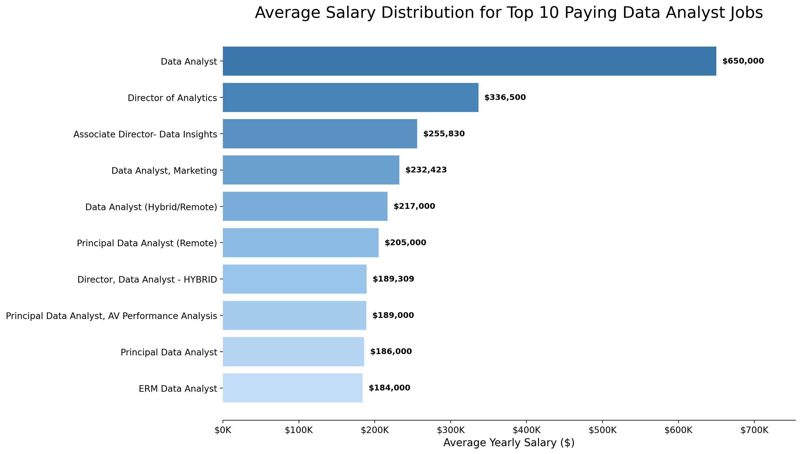
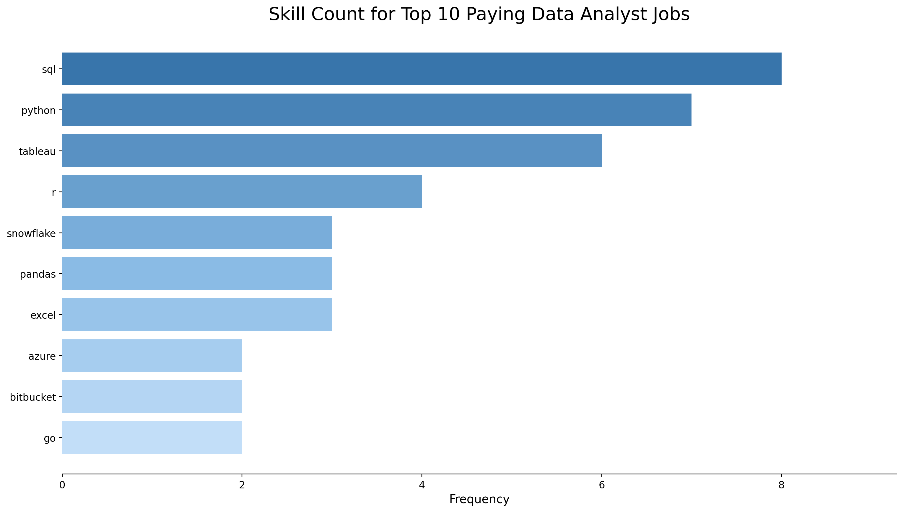
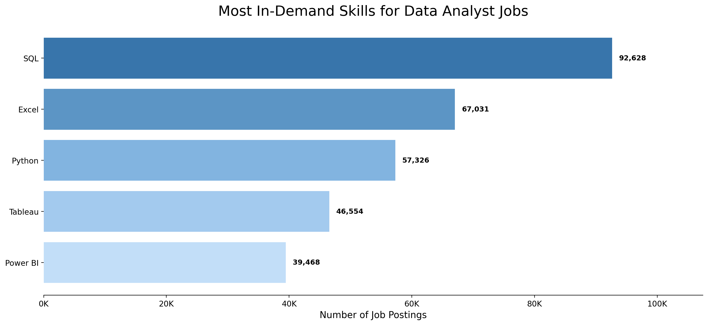

# Data Analyst Job Market SQL Analysis

## Introduction

This project explores the data analyst job market using SQL. The analysis focuses on remote Data Analyst roles, salary trends, in-demand skills, and the skills that offer the best balance between demand and pay.

SQL queries are available in the [project_sql folder](project_sql/).

## Background

The goal of this project is to better understand what employers are looking for in Data Analyst roles and which skills can improve job opportunities. The dataset includes job postings, companies, salaries, locations, and skills connected to each posting.

The analysis answers five main questions:

1. What are the top-paying remote Data Analyst jobs?
2. What skills are required for the top-paying Data Analyst jobs?
3. What skills are most in demand for Data Analysts?
4. Which skills are associated with higher salaries?
5. What are the most optimal skills to learn based on demand and salary?

## Tools Used

- **SQL:** Used to query, join, aggregate, and analyze the job posting data.
- **PostgreSQL:** Database system used for storing and querying the dataset.
- **pgAdmin / Visual Studio Code:** Used to write and run SQL queries.
- **Git & GitHub:** Used for version control and project sharing.

## The Analysis

Each SQL file in `project_sql` answers one analysis question.

### 1. Top-Paying Data Analyst Jobs

File: [project_sql/1.sql](project_sql/1.sql)

This query identifies the top 10 highest-paying remote Data Analyst roles where salary data is available. It joins job postings with company data so the output includes the company name.

```sql
SELECT 
    job_id,
    job_title,
    job_location,
    salary_year_avg,
    name AS company_name
FROM
    job_postings_fact
LEFT JOIN 
    company_dim ON job_postings_fact.company_id = company_dim.company_id
WHERE 
    job_title_short = 'Data Analyst' AND
    job_location = 'Anywhere' AND
    salary_year_avg IS NOT NULL
ORDER BY
    salary_year_avg DESC
LIMIT 10;
```

| Job ID | Job Title | Location | Average Yearly Salary | Company |
|---:|---|---|---:|---|
| 226942 | Data Analyst | Anywhere | $650,000.00 | Mantys |
| 547382 | Director of Analytics | Anywhere | $336,500.00 | Meta |
| 552322 | Associate Director- Data Insights | Anywhere | $255,829.50 | AT&T |
| 99305 | Data Analyst, Marketing | Anywhere | $232,423.00 | Pinterest Job Advertisements |
| 1021647 | Data Analyst (Hybrid/Remote) | Anywhere | $217,000.00 | Uclahealthcareers |
| 168310 | Principal Data Analyst (Remote) | Anywhere | $205,000.00 | SmartAsset |
| 731368 | Director, Data Analyst - HYBRID | Anywhere | $189,309.00 | Inclusively |
| 310660 | Principal Data Analyst, AV Performance Analysis | Anywhere | $189,000.00 | Motional |
| 1749593 | Principal Data Analyst | Anywhere | $186,000.00 | SmartAsset |
| 387860 | ERM Data Analyst | Anywhere | $184,000.00 | Get It Recruit - Information Technology |

This helps show which remote Data Analyst roles offer the highest salary potential and which companies are hiring for those roles.



### 2. Skills Required for Top-Paying Jobs

File: [project_sql/2.sql](project_sql/2.sql)

This query first finds the top-paying remote Data Analyst jobs, then joins those jobs to the skills tables to show which skills are required for those roles.

```sql
WITH top_paying_jobs AS
(   SELECT 
        job_id,
        job_title,
        job_location,
        salary_year_avg,
        name AS company_name
    FROM
        job_postings_fact
    LEFT JOIN 
        company_dim ON job_postings_fact.company_id = company_dim.company_id
    WHERE 
        job_title_short = 'Data Analyst' AND
        job_location = 'Anywhere' AND
        salary_year_avg IS NOT NULL
    ORDER BY
        salary_year_avg DESC
    LIMIT 10
)
SELECT 
    top_paying_jobs.*,
    skills_dim.skills
FROM top_paying_jobs
INNER JOIN skills_job_dim ON top_paying_jobs.job_id = skills_job_dim.job_id
INNER JOIN skills_dim ON skills_job_dim.skill_id = skills_dim.skill_id
ORDER BY salary_year_avg DESC;
```

The query returns one row per job-skill pair, so the same job appears multiple times when it requires multiple skills.

| Job ID | Job Title | Location | Salary | Company | Skill |
|---:|---|---|---:|---|---|
| 552322 | Associate Director- Data Insights | Anywhere | $255,829.50 | AT&T | SQL |
| 552322 | Associate Director- Data Insights | Anywhere | $255,829.50 | AT&T | Python |
| 552322 | Associate Director- Data Insights | Anywhere | $255,829.50 | AT&T | R |
| 552322 | Associate Director- Data Insights | Anywhere | $255,829.50 | AT&T | Azure |
| 552322 | Associate Director- Data Insights | Anywhere | $255,829.50 | AT&T | Databricks |
| 552322 | Associate Director- Data Insights | Anywhere | $255,829.50 | AT&T | AWS |
| 552322 | Associate Director- Data Insights | Anywhere | $255,829.50 | AT&T | Pandas |
| 552322 | Associate Director- Data Insights | Anywhere | $255,829.50 | AT&T | PySpark |
| 552322 | Associate Director- Data Insights | Anywhere | $255,829.50 | AT&T | Jupyter |
| 552322 | Associate Director- Data Insights | Anywhere | $255,829.50 | AT&T | Excel |
| 552322 | Associate Director- Data Insights | Anywhere | $255,829.50 | AT&T | Tableau |
| 552322 | Associate Director- Data Insights | Anywhere | $255,829.50 | AT&T | Power BI |
| 552322 | Associate Director- Data Insights | Anywhere | $255,829.50 | AT&T | PowerPoint |
| 99305 | Data Analyst, Marketing | Anywhere | $232,423.00 | Pinterest Job Advertisements | SQL |
| 99305 | Data Analyst, Marketing | Anywhere | $232,423.00 | Pinterest Job Advertisements | Python |
| 99305 | Data Analyst, Marketing | Anywhere | $232,423.00 | Pinterest Job Advertisements | R |
| 99305 | Data Analyst, Marketing | Anywhere | $232,423.00 | Pinterest Job Advertisements | Hadoop |
| 99305 | Data Analyst, Marketing | Anywhere | $232,423.00 | Pinterest Job Advertisements | Tableau |
| 1021647 | Data Analyst (Hybrid/Remote) | Anywhere | $217,000.00 | Uclahealthcareers | SQL |
| 1021647 | Data Analyst (Hybrid/Remote) | Anywhere | $217,000.00 | Uclahealthcareers | Crystal |
| 1021647 | Data Analyst (Hybrid/Remote) | Anywhere | $217,000.00 | Uclahealthcareers | Oracle |
| 1021647 | Data Analyst (Hybrid/Remote) | Anywhere | $217,000.00 | Uclahealthcareers | Tableau |
| 1021647 | Data Analyst (Hybrid/Remote) | Anywhere | $217,000.00 | Uclahealthcareers | Flow |
| 168310 | Principal Data Analyst (Remote) | Anywhere | $205,000.00 | SmartAsset | SQL |
| 168310 | Principal Data Analyst (Remote) | Anywhere | $205,000.00 | SmartAsset | Python |
| 168310 | Principal Data Analyst (Remote) | Anywhere | $205,000.00 | SmartAsset | Go |
| 168310 | Principal Data Analyst (Remote) | Anywhere | $205,000.00 | SmartAsset | Snowflake |
| 168310 | Principal Data Analyst (Remote) | Anywhere | $205,000.00 | SmartAsset | Pandas |
| 168310 | Principal Data Analyst (Remote) | Anywhere | $205,000.00 | SmartAsset | NumPy |
| 168310 | Principal Data Analyst (Remote) | Anywhere | $205,000.00 | SmartAsset | Excel |
| 168310 | Principal Data Analyst (Remote) | Anywhere | $205,000.00 | SmartAsset | Tableau |
| 168310 | Principal Data Analyst (Remote) | Anywhere | $205,000.00 | SmartAsset | GitLab |
| 731368 | Director, Data Analyst - HYBRID | Anywhere | $189,309.00 | Inclusively | SQL |
| 731368 | Director, Data Analyst - HYBRID | Anywhere | $189,309.00 | Inclusively | Python |
| 731368 | Director, Data Analyst - HYBRID | Anywhere | $189,309.00 | Inclusively | Azure |
| 731368 | Director, Data Analyst - HYBRID | Anywhere | $189,309.00 | Inclusively | AWS |
| 731368 | Director, Data Analyst - HYBRID | Anywhere | $189,309.00 | Inclusively | Oracle |
| 731368 | Director, Data Analyst - HYBRID | Anywhere | $189,309.00 | Inclusively | Snowflake |
| 731368 | Director, Data Analyst - HYBRID | Anywhere | $189,309.00 | Inclusively | Tableau |
| 731368 | Director, Data Analyst - HYBRID | Anywhere | $189,309.00 | Inclusively | Power BI |
| 731368 | Director, Data Analyst - HYBRID | Anywhere | $189,309.00 | Inclusively | SAP |
| 731368 | Director, Data Analyst - HYBRID | Anywhere | $189,309.00 | Inclusively | Jenkins |
| 731368 | Director, Data Analyst - HYBRID | Anywhere | $189,309.00 | Inclusively | Bitbucket |
| 731368 | Director, Data Analyst - HYBRID | Anywhere | $189,309.00 | Inclusively | Atlassian |
| 731368 | Director, Data Analyst - HYBRID | Anywhere | $189,309.00 | Inclusively | Jira |
| 731368 | Director, Data Analyst - HYBRID | Anywhere | $189,309.00 | Inclusively | Confluence |
| 310660 | Principal Data Analyst, AV Performance Analysis | Anywhere | $189,000.00 | Motional | SQL |
| 310660 | Principal Data Analyst, AV Performance Analysis | Anywhere | $189,000.00 | Motional | Python |
| 310660 | Principal Data Analyst, AV Performance Analysis | Anywhere | $189,000.00 | Motional | R |
| 310660 | Principal Data Analyst, AV Performance Analysis | Anywhere | $189,000.00 | Motional | Git |
| 310660 | Principal Data Analyst, AV Performance Analysis | Anywhere | $189,000.00 | Motional | Bitbucket |
| 310660 | Principal Data Analyst, AV Performance Analysis | Anywhere | $189,000.00 | Motional | Atlassian |
| 310660 | Principal Data Analyst, AV Performance Analysis | Anywhere | $189,000.00 | Motional | Jira |
| 310660 | Principal Data Analyst, AV Performance Analysis | Anywhere | $189,000.00 | Motional | Confluence |
| 1749593 | Principal Data Analyst | Anywhere | $186,000.00 | SmartAsset | SQL |
| 1749593 | Principal Data Analyst | Anywhere | $186,000.00 | SmartAsset | Python |
| 1749593 | Principal Data Analyst | Anywhere | $186,000.00 | SmartAsset | Go |
| 1749593 | Principal Data Analyst | Anywhere | $186,000.00 | SmartAsset | Snowflake |
| 1749593 | Principal Data Analyst | Anywhere | $186,000.00 | SmartAsset | Pandas |
| 1749593 | Principal Data Analyst | Anywhere | $186,000.00 | SmartAsset | NumPy |
| 1749593 | Principal Data Analyst | Anywhere | $186,000.00 | SmartAsset | Excel |
| 1749593 | Principal Data Analyst | Anywhere | $186,000.00 | SmartAsset | Tableau |
| 1749593 | Principal Data Analyst | Anywhere | $186,000.00 | SmartAsset | GitLab |
| 387860 | ERM Data Analyst | Anywhere | $184,000.00 | Get It Recruit - Information Technology | SQL |
| 387860 | ERM Data Analyst | Anywhere | $184,000.00 | Get It Recruit - Information Technology | Python |
| 387860 | ERM Data Analyst | Anywhere | $184,000.00 | Get It Recruit - Information Technology | R |

This shows which technical skills appear in the highest-paying opportunities.



### 3. Most In-Demand Skills

File: [project_sql/3.sql](project_sql/3.sql)

This query counts how often each skill appears in Data Analyst job postings.

```sql
SELECT 
    skills_dim.skills,
    COUNT(skills_job_dim.job_id) AS demand_count
FROM job_postings_fact
INNER JOIN skills_job_dim ON job_postings_fact.job_id = skills_job_dim.job_id
INNER JOIN skills_dim ON skills_job_dim.skill_id = skills_dim.skill_id
WHERE
    job_title_short = 'Data Analyst'
GROUP BY skills
ORDER BY demand_count DESC
LIMIT 5;
```

| Skill | Demand Count |
|---|---:|
| SQL | 92,628 |
| Excel | 67,031 |
| Python | 57,326 |
| Tableau | 46,554 |
| Power BI | 39,468 |

SQL is the most requested skill for Data Analyst roles, followed by Excel and Python. Visualization tools like Tableau and Power BI also appear strongly, showing that employers value both data querying and reporting skills.



### 4. Skills Based on Salary

File: [project_sql/4.sql](project_sql/4.sql)

This query calculates the average salary for each skill in Data Analyst postings. It helps identify which skills are linked to higher-paying roles.

```sql
SELECT 
    skills_dim.skills,
    ROUND(AVG(salary_year_avg), 2) AS avg_salary
FROM job_postings_fact
INNER JOIN skills_job_dim ON job_postings_fact.job_id = skills_job_dim.job_id
INNER JOIN skills_dim ON skills_job_dim.skill_id = skills_dim.skill_id
WHERE
    job_title_short = 'Data Analyst'
    AND salary_year_avg IS NOT NULL
GROUP BY skills
ORDER BY avg_salary DESC
LIMIT 25;
```

| Skill | Average Salary |
|---|---:|
| SVN | $400,000.00 |
| Solidity | $179,000.00 |
| Couchbase | $160,515.00 |
| DataRobot | $155,485.50 |
| Golang | $155,000.00 |
| MXNet | $149,000.00 |
| Dplyr | $147,633.33 |
| VMware | $147,500.00 |
| Terraform | $146,733.83 |
| Twilio | $138,500.00 |
| GitLab | $134,126.00 |
| Kafka | $129,999.16 |
| Puppet | $129,820.00 |
| Keras | $127,013.33 |
| PyTorch | $125,226.20 |
| Perl | $124,685.75 |
| Ansible | $124,370.00 |
| Hugging Face | $123,950.00 |
| TensorFlow | $120,646.83 |
| Cassandra | $118,406.68 |
| Notion | $118,091.67 |
| Atlassian | $117,965.60 |
| Bitbucket | $116,711.75 |
| Airflow | $116,387.26 |
| Scala | $115,479.53 |

The highest-paying skills are mostly specialized engineering, machine learning, cloud, and automation tools. Some very high values, such as SVN at $400,000, may come from a small number of postings, so demand should be considered together with salary.

### 5. Most Optimal Skills to Learn

File: [project_sql/5.sql](project_sql/5.sql)

This query combines demand and salary by finding skills that appear in more than 10 remote Data Analyst job postings and calculating their average salary.

```sql
SELECT 
    skills_dim.skill_id,
    skills_dim.skills,
    COUNT(skills_job_dim.job_id) AS demand_count,
    ROUND(AVG(salary_year_avg), 2) AS avg_salary
FROM job_postings_fact
INNER JOIN skills_job_dim ON job_postings_fact.job_id = skills_job_dim.job_id
INNER JOIN skills_dim ON skills_job_dim.skill_id = skills_dim.skill_id
WHERE
    job_title_short = 'Data Analyst'
    AND salary_year_avg IS NOT NULL
    AND job_work_from_home = TRUE
GROUP BY skills_dim.skill_id
HAVING COUNT(skills_job_dim.job_id) > 10
ORDER BY avg_salary DESC, demand_count DESC
LIMIT 25;
```

| Skill ID | Skill | Demand Count | Average Salary |
|---:|---|---:|---:|
| 8 | Go | 27 | $115,319.89 |
| 234 | Confluence | 11 | $114,209.91 |
| 97 | Hadoop | 22 | $113,192.57 |
| 80 | Snowflake | 37 | $112,947.97 |
| 74 | Azure | 34 | $111,225.10 |
| 77 | BigQuery | 13 | $109,653.85 |
| 76 | AWS | 32 | $108,317.30 |
| 4 | Java | 17 | $106,906.44 |
| 194 | SSIS | 12 | $106,683.33 |
| 233 | Jira | 20 | $104,917.90 |
| 79 | Oracle | 37 | $104,533.70 |
| 185 | Looker | 49 | $103,795.30 |
| 2 | NoSQL | 13 | $101,413.73 |
| 1 | Python | 236 | $101,397.22 |
| 5 | R | 148 | $100,498.77 |
| 78 | Redshift | 16 | $99,936.44 |
| 187 | Qlik | 13 | $99,630.81 |
| 182 | Tableau | 230 | $99,287.65 |
| 197 | SSRS | 14 | $99,171.43 |
| 92 | Spark | 13 | $99,076.92 |
| 13 | C++ | 11 | $98,958.23 |
| 186 | SAS | 63 | $98,902.37 |
| 7 | SAS | 63 | $98,902.37 |
| 61 | SQL Server | 35 | $97,785.73 |
| 9 | JavaScript | 20 | $97,587.00 |

The most optimal skills combine strong salaries with meaningful demand. Cloud and big data tools such as Snowflake, Azure, AWS, BigQuery, and Hadoop rank highly, while Python, R, Tableau, and SQL Server remain practical choices because they combine broad demand with strong salaries.

Note: SAS appears twice with different `skill_id` values, so the source data likely has duplicate skill entries.

## What I Learned

- How to use `JOIN` to combine job postings, company data, and skill data.
- How to use `GROUP BY`, `COUNT()`, and `AVG()` to summarize job market trends.
- How to use CTEs with `WITH` to break complex analysis into readable steps.
- How to filter results with `WHERE` and `HAVING` depending on whether the condition applies before or after aggregation.
- How to rank results using `ORDER BY` and `LIMIT`.

## Conclusions

This project shows how SQL can be used to answer practical job market questions. The analysis focuses on salary, demand, and skill requirements for Data Analyst roles.

Key takeaways:

1. Remote Data Analyst roles can have strong salary potential when salary data is available.
2. Top-paying roles often require technical skills that go beyond basic spreadsheet work.
3. In-demand skills are useful for employability, while salary-based analysis shows which skills may be more financially valuable.
4. The most optimal skills are those that combine high demand with strong average salaries.
5. SQL is central to this analysis and remains an important skill for data analyst work.

